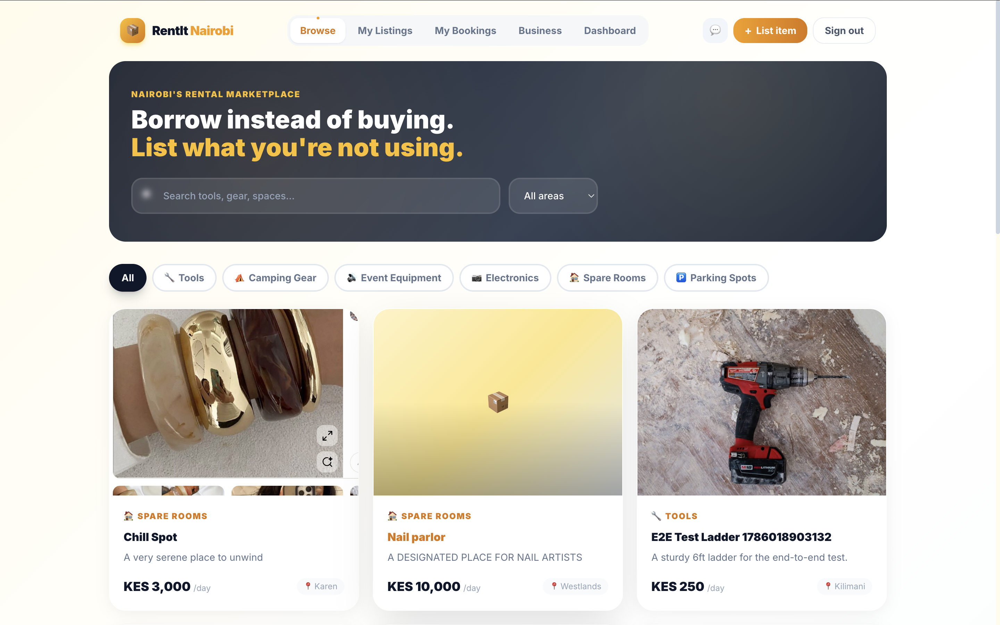
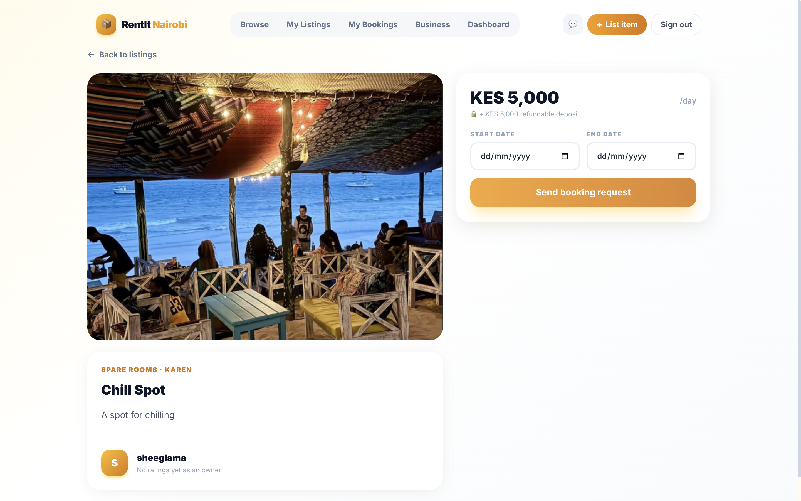
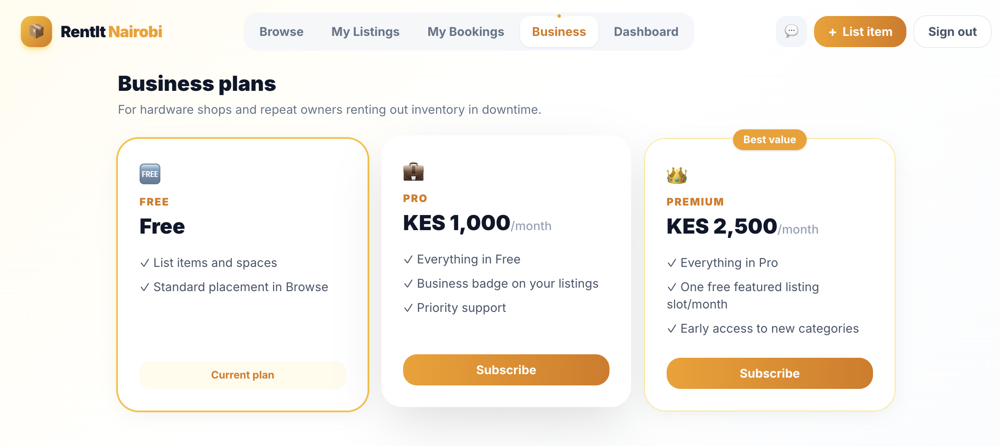
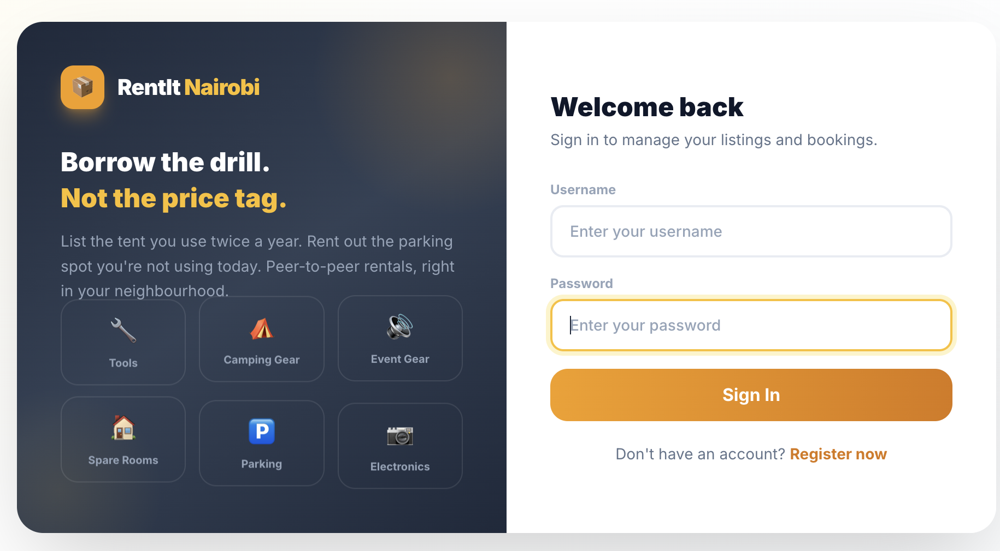

# RentIt Nairobi 📦

A peer-to-peer rental marketplace for Nairobi — "Airbnb for stuff." List tools, camping gear, event equipment, spare rooms, and parking spots for short-term rent instead of buying what you'll use once. Built with React and FastAPI, with M-Pesa deposit escrow, a two-way rating system, in-app messaging, real-time message notifications, Cloudinary image storage, and platform monetization (commission, featured listings, business subscriptions) layered on top.

---





## What It Does

- **Visitors** land on a dedicated marketing page, browse featured listings without an account, and see how the platform works before signing up
- **Renters** browse listings by area and category, request to rent for a date range, check availability before picking dates, pay the rental fee + deposit in one M-Pesa STK Push, message the owner to coordinate pickup or arrange a viewing, track booking status, and rate the owner once the rental is complete
- **Owners** list items or spaces with Cloudinary-hosted photos, manage incoming requests (accept/decline), message renters directly, mark rentals completed, then release the deposit back to the renter or claim it for damage/no-return, and rate the renter
- **Business owners** (hardware shops, repeat listers) subscribe to a Pro or Premium monthly plan for a badge and perks; any owner can pay to feature a listing for 7 days so it sorts to the top of Browse
- **Admins** see a platform revenue dashboard — commission earned, featured-listing revenue, and subscription revenue in one place

---

## Design System

Amber/slate palette — deliberately distinct from RescueMePets' teal/coral, its own brand energy for tools/hardware/marketplace. Inter typeface throughout.

| Class | Purpose |
|---|---|
| `.page-bg` | Full-page amber/white/slate gradient background |
| `.btn-primary` | Amber gradient button with hover lift + glow |
| `.btn-ghost` | Transparent outlined button with blur backdrop |
| `.card` | White/glass card, shadow, hover lift — for clickable containers |
| `.card-static` | Same surface as `.card` without the hover lift — for info/stat panels |
| `.glass` | Frosted glass panel — used on sticky booking card and chat modals |
| `.input-field` | Styled input with amber focus ring |
| `.img-placeholder` | Soft gradient + icon fallback for listings with no photo |
| `.skeleton` | Shimmer loading placeholder |
| `.badge` | Small status/label pill |

### Animations (`index.css`)
`fadeUp`, `scaleIn`, `slideDown`, `slideUp`, `float`, `gradientShift`, `pulse-ring`, `shimmer` — all defined as keyframes with utility classes (`.animate-fade-up`, `.animate-scale-in`, etc.). A `.stagger` parent class staggers child animation delays automatically.

Shared components: `ListingThumb` (thumbnail with fallback), `PhotoGallery` (main image + strip), `AuthLayout` (branded split-panel), `MpesaPaymentModal` / `SimplePaymentModal` (STK-push → poll → confirm), `BookingChat` (message thread modal, portalled to `document.body`), `MessageBell` (unread badge + dropdown in Nav).

---

## Features

### 🏠 Landing Page
A dedicated marketing page (`/`) for logged-out visitors — dark slate hero with animated amber gradient headline, category pills, trust stats bar (items listed, zero listing fee, 2-way ratings, M-Pesa), "How it works" 3-step section, live listings grid pulled from the backend, category browse grid, and an owner CTA banner. Logged-in users are redirected straight to `/dashboard`.

### 🔐 Authentication
JWT auth with short-lived access tokens (30 min) + rotating, revocable refresh tokens (30 days, hashed at rest). Rate-limited login (30 attempts / 15 min) and register (10 / 10 min) via an in-memory sliding-window limiter. The login counter resets on a successful login so switching accounts never triggers a false lockout. No role enum — the same account is routinely both an owner and a renter; `is_admin` is the one genuinely exclusive permission.

An admin account is created on first startup only when `ADMIN_PASSWORD` is explicitly provisioned. Optional `ADMIN_USERNAME` and `ADMIN_EMAIL` environment variables customize its identity — there is no default administrator password.

### 🔍 Browse & Listings
Public — no login required. Filter by area and category, or search by title and description. Featured listings sort first with a ★ badge. Paginated (12 per page). Each listing card shows a business badge if the owner has a business subscription. Availability calendar on the detail page shows already-booked date ranges so renters can pick valid dates before submitting.

Photos are uploaded to **Cloudinary** (drag-and-drop or file picker, up to 5 MB, JPEG/PNG/WebP). At least one photo is required to create or edit a listing.

### 📅 Bookings
Renter picks a date range → server checks for overlapping bookings (409 if conflict) → total price computed server-side → owner accepts or declines → renter pays → owner marks completed. Status transitions enforced server-side with ownership checks on every action.

### 💬 Booking Messages
Owner and renter can message each other on any `requested`, `accepted`, or `completed` booking — to ask questions, arrange a viewing before committing, or coordinate pickup time and location.

- Messages stored in `booking_messages` table with a `read_by` column (comma-separated user IDs)
- `GET /bookings/{id}/messages` returns the thread and marks all messages read for the caller
- `POST /bookings/{id}/messages` sends a new message
- `GET /messages/unread` returns a summary of all bookings with unread messages for the current user — listing title, unread count, latest message preview, sender name, and timestamp
- The chat UI polls every 5 seconds for new messages while open
- The **MessageBell** (💬) in the Nav polls `/messages/unread` every 8 seconds, shows an amber badge with the total unread count, and opens a dropdown listing each unread thread — clicking one opens the chat modal directly without navigating away
- The `BookingChat` modal is portalled to `document.body` so it renders above all other UI regardless of where it's triggered from (Nav bell, My Bookings, or My Listings requests panel)

### 💳 M-Pesa Payments & Deposit Escrow
Full Safaricom Daraja API integration:
- One STK Push covers the rental fee + deposit together
- Frontend polls payment status every 5 seconds, with a manual "I already paid" fallback for local dev (no public callback URL needed)
- Platform takes 12% commission on the rental fee (deposit excluded — it's refundable)
- Owner can release the deposit (B2C payout to renter) or claim it with a required reason (B2C payout to owner)

### ⭐ Ratings
Renter and owner each rate the other once per completed booking (1–5 stars + comment). Separate `rating_as_owner` / `rating_as_renter` aggregates — the same person can be a great owner and a bad renter, and those signals stay distinct.

### 💰 Monetization
- **Commission** — 12% of rental fee on every paid booking
- **Featured listings** — KES 200 for 7 days at the top of Browse; stacks if renewed early
- **Business subscriptions** — Pro (KES 1,000/mo) and Premium (KES 2,500/mo); badge shown on listing cards in Browse
- **Admin revenue dashboard** — all three revenue streams in one view

---

## Tech Stack

### Frontend
- **React 18** with hooks, **React Router 6**
- **Tailwind CSS 3** with custom `amber`/`slate` palette, `Inter` typeface, and extended animation keyframes
- `apiFetch` wrapper (`api.js`) with automatic access-token refresh-and-retry on 401
- `createPortal` for modals that need to escape parent stacking contexts

### Backend
- **FastAPI** + **SQLAlchemy** (SQLite locally; swap `DATABASE_URL` for Postgres in production)
- **PyJWT** + **bcrypt** for auth
- **Cloudinary** (`cloudinary` SDK) — image upload endpoint at `POST /upload-image`
- **Safaricom Daraja API** (`daraja.py`) — STK Push, payment status polling, B2C payouts
- **Pydantic** for request/response validation

---

## Project Structure

```
rental-marketplace/
├── backend/
│   ├── main.py              # All FastAPI endpoints
│   ├── auth.py               # JWT issuance/verification, rate limiting, auth dependencies
│   ├── daraja.py              # M-Pesa Daraja API integration (STK Push, query, B2C)
│   ├── models.py              # SQLAlchemy models
│   ├── schemas.py             # Pydantic schemas
│   ├── database.py            # DB connection and session config
│   ├── seed_data.py           # Seeds areas, categories, sample listings, and admin account
│   ├── .env                   # Secrets (not committed)
│   └── requirements.txt       # Python dependencies
├── src/
│   ├── components/
│   │   ├── LandingPage.js        # Marketing landing page for logged-out visitors
│   │   ├── AuthLayout.js         # Branded split-panel layout shared by Login/Register
│   │   ├── Login.js / Register.js
│   │   ├── Nav.js                # Sticky nav — scrolls to glass, MessageBell, mobile pills
│   │   ├── Dashboard.js          # Animated hero, stat cards, quick actions
│   │   ├── Browse.js             # Dark hero search, category pills, paginated grid
│   │   ├── ListingThumb.js       # Single-photo thumbnail with fallback
│   │   ├── PhotoGallery.js       # Main image + thumbnail strip
│   │   ├── ListingDetail.js      # Gallery, availability calendar, sticky booking card
│   │   ├── CreateListing.js      # Listing form with Cloudinary photo uploader + live preview
│   │   ├── MyListings.js         # Owner listings, requests panel, edit modal, message button
│   │   ├── MyBookings.js         # Renter bookings, pay/cancel/rate/message buttons
│   │   ├── BookingChat.js        # Message thread modal (portalled, polls every 5s)
│   │   ├── MessageBell.js        # Unread badge + dropdown in Nav (polls every 8s)
│   │   ├── MpesaPaymentModal.js  # STK-push modal for booking payments
│   │   ├── SimplePaymentModal.js # Generic STK-push modal (featuring, subscriptions)
│   │   ├── RatingModal.js        # 1–5 star + comment rating form
│   │   ├── Business.js           # Plan comparison + subscribe flow
│   │   └── AdminRevenue.js       # Platform revenue dashboard (admin-only)
│   ├── api.js               # Authenticated fetch wrapper (token attach + refresh)
│   ├── App.js               # Root component and routing (/ → LandingPage for guests)
│   ├── constants.js         # API base URL config
│   └── index.js             # React entry point
├── tailwind.config.js       # Custom colors, shadows, and animation keyframes
└── package.json
```

---

## Database Schema

### Users
| Column | Type | Notes |
|---|---|---|
| id | Integer | Primary Key |
| username, email, phone | String | Unique |
| password | String | bcrypt hashed |
| is_admin, is_business | Boolean | |
| rating_as_owner_avg/count | Float/Integer | Separate from renter rating |
| rating_as_renter_avg/count | Float/Integer | |
| deleted_at | DateTime | Soft delete |

### Listings
| Column | Type | Notes |
|---|---|---|
| id | Integer | Primary Key |
| owner_id, category_id, area_id | Integer | Foreign Keys |
| title, description, price_per_day, deposit_amount | | |
| photos | String | Comma-separated Cloudinary URLs |
| status | String | active / paused / deleted |
| featured_until | DateTime | Sorts first in Browse while in the future |

### Bookings
| Column | Type | Notes |
|---|---|---|
| id | Integer | Primary Key |
| listing_id, renter_id | Integer | Foreign Keys |
| start_date, end_date, total_price, deposit_amount | | |
| status | String | requested / accepted / declined / cancelled / completed |
| payment_status | String | unpaid / paid |
| deposit_status | String | none / held / released / claimed |
| deposit_claim_reason | Text | Set when owner claims the deposit |

### BookingMessages
| Column | Type | Notes |
|---|---|---|
| id | Integer | Primary Key |
| booking_id, sender_id | Integer | Foreign Keys |
| body | Text | |
| read_by | String | Comma-separated user IDs who have read this message |
| created_at | DateTime | |

### Payments
| Column | Type | Notes |
|---|---|---|
| id | Integer | Primary Key |
| purpose | String | booking / feature / subscription |
| booking_id, listing_id, plan | | One set per purpose |
| rental_amount, deposit_amount, amount | Float | `amount` is what STK charges |
| platform_commission | Float | 12% of rental_amount, booking payments only |
| status | String | pending / completed / failed |
| checkout_request_id, mpesa_receipt | String | M-Pesa references |

### Ratings
| Column | Type | Notes |
|---|---|---|
| id | Integer | Primary Key |
| booking_id, rater_id, ratee_id | Integer | Foreign Keys |
| rated_role | String | owner / renter |
| score | Integer | 1–5 |
| comment | Text | |

Unique on `(booking_id, rated_role)` — one rating per direction per booking.

### BusinessSubscriptions
| Column | Type | Notes |
|---|---|---|
| id | Integer | Primary Key |
| user_id | Integer | Foreign Key, unique |
| plan | String | pro / premium |
| price_per_month | Float | |
| active | Boolean | |
| current_period_end | DateTime | Stacks on early renewal |

### Areas / Categories
Seeded reference data — Nairobi estates (Kilimani marked `is_launch_area=True`) and item/space categories.

---

## API Endpoints

All endpoints requiring auth expect `Authorization: Bearer <access_token>`. Public endpoints (`/listings`, `/listings/{id}`, `/listings/{id}/booked-dates`, `/areas`, `/categories`) work without a token.

### Auth
| Method | Endpoint | Description |
|---|---|---|
| POST | `/register` | Register a new account |
| POST | `/login` | Authenticate — returns a token pair (counter resets on success) |
| POST | `/auth/refresh` | Exchange a refresh token for a new pair (rotates) |
| POST | `/auth/logout` | Revoke a refresh token |
| GET | `/me` | Current user's profile + rating aggregates |

### Areas & Categories
| Method | Endpoint | Description |
|---|---|---|
| GET | `/areas`, `/categories` | Seeded reference data (public) |

### Images
| Method | Endpoint | Description |
|---|---|---|
| POST | `/upload-image` | Upload a photo to Cloudinary — returns `{ url }` |

### Listings
| Method | Endpoint | Description |
|---|---|---|
| GET | `/listings` | Browse — `category_id`, `area_id`, `q` (title+description), `limit`, `offset` (public) |
| GET | `/listings/{id}` | Get one listing (public) |
| GET | `/listings/{id}/booked-dates` | Accepted/completed booking date ranges (public) |
| POST | `/listings` | Create a listing |
| PATCH | `/listings/{id}` | Update a listing (owner only) |
| DELETE | `/listings/{id}` | Soft-delete a listing (owner only) |
| GET | `/my-listings` | Current user's listings |

### Bookings
| Method | Endpoint | Description |
|---|---|---|
| POST | `/listings/{id}/bookings` | Request to rent — 409 if dates overlap an existing booking |
| GET | `/my-bookings` | Current user's bookings (as renter) |
| GET | `/listings/{id}/bookings` | Booking requests on a listing (owner only) |
| PATCH | `/bookings/{id}` | Transition status — accept/decline/cancel/complete |

### Booking Messages
| Method | Endpoint | Description |
|---|---|---|
| GET | `/bookings/{id}/messages` | Fetch thread + mark all as read for caller |
| POST | `/bookings/{id}/messages` | Send a message |
| GET | `/messages/unread` | All bookings with unread messages for the current user |

### Payments (M-Pesa)
| Method | Endpoint | Description |
|---|---|---|
| POST | `/bookings/{id}/pay` | STK Push for rental fee + deposit |
| GET | `/payments/{id}/status` | Poll payment status |
| POST | `/pay/callback` | Safaricom webhook for STK Push confirmation |
| POST | `/payments/{id}/test-complete` | Manually complete a payment (dev-only) |

### Deposits
| Method | Endpoint | Description |
|---|---|---|
| POST | `/bookings/{id}/release-deposit` | B2C payout back to renter |
| POST | `/bookings/{id}/claim-deposit` | B2C payout to owner with required reason |

### Ratings
| Method | Endpoint | Description |
|---|---|---|
| POST | `/bookings/{id}/rate` | Rate the other party on a completed booking |
| GET | `/bookings/{id}/ratings` | Ratings left on a booking |

### Monetization
| Method | Endpoint | Description |
|---|---|---|
| POST | `/listings/{id}/feature` | STK Push to feature a listing for 7 days |
| GET | `/business/subscription` | Current user's subscription status |
| POST | `/business/subscribe` | STK Push to subscribe to Pro/Premium |
| GET | `/admin/revenue` | Platform revenue summary (admin-only) |

---

## Installation & Setup

### Prerequisites
- Node.js v18+
- Python 3.9+
- npm, pip
- A free [Cloudinary](https://cloudinary.com) account

### Backend

```bash
cd backend
python -m venv venv
source venv/bin/activate       # Windows: venv\Scripts\activate
pip install -r requirements.txt
```

Create `backend/.env`:

```env
# M-Pesa (Safaricom Daraja Portal: https://developer.safaricom.co.ke)
MPESA_CONSUMER_KEY=<your_consumer_key>
MPESA_CONSUMER_SECRET=<your_consumer_secret>
MPESA_SHORTCODE=174379
MPESA_PASSKEY=<your_passkey>
MPESA_CALLBACK_URL=https://<your-domain>/pay/callback
MPESA_ENV=sandbox

JWT_SECRET=<a long random string>

# Cloudinary (https://cloudinary.com/console)
CLOUDINARY_CLOUD_NAME=<your_cloud_name>
CLOUDINARY_API_KEY=<your_api_key>
CLOUDINARY_API_SECRET=<your_api_secret>

# Admin bootstrap — the account is only created if ADMIN_PASSWORD is set.
# There is no default admin password.
ADMIN_USERNAME=admin
ADMIN_EMAIL=admin@example.com
ADMIN_PASSWORD=<choose_your_own_password>

# Set to "production" to disable /payments/{id}/test-complete
ENV=development
```

Seed reference data, sample listings, and the admin account:

```bash
python seed_data.py
```

Run the server:

```bash
uvicorn main:app --reload --port 8001
```

Backend runs at `http://localhost:8001` — Swagger docs at `http://localhost:8001/docs`

### Frontend

```bash
npm install
npm start
```

Frontend runs at `http://localhost:3001`

---

## Roadmap

- ✅ **Phase 0 — Scaffolding & auth**: JWT auth, areas/categories browse scaffolding, admin seed on startup
- ✅ **Phase 1 — Listings & bookings**: full listing CRUD, browse/filter, booking request lifecycle, overlap check
- ✅ **Phase 2 — Trust & payments**: M-Pesa STK Push, deposit hold/release/claim escrow, two-way ratings
- ✅ **Phase 3 — Monetization**: booking commission, featured listings, business subscriptions, admin revenue dashboard
- ✅ **Phase 4 — Visual polish**: landing page, animated UI (glassmorphism, stagger, shimmer skeletons), sticky nav, dark hero search, Cloudinary image uploads, availability calendar, public Browse/ListingDetail, description search, pagination
- ✅ **Phase 5 — Messaging**: booking message threads, read tracking, MessageBell with unread badge and dropdown, portal-based chat modal accessible from Nav/My Bookings/My Listings
- ⬜ **Not yet built**: admin dispute review for deposit claims (currently owner-self-serve), automated owner payout of rental-fee revenue, phone/ID verification flow (fields exist on `User`, no flow behind them yet), real-time WebSocket messaging (currently REST polling every 5s)

---

## License

MIT License.# RentIt Nairobi 📦

A peer-to-peer rental marketplace for Nairobi — "Airbnb for stuff." List tools, camping gear, event equipment, spare rooms, and parking spots for short-term rent instead of buying what you'll use once. Built with React and FastAPI, with M-Pesa deposit escrow, a two-way rating system, in-app messaging, real-time message notifications, Cloudinary image storage, and platform monetization (commission, featured listings, business subscriptions) layered on top.

---

## What It Does

- **Visitors** land on a dedicated marketing page, browse featured listings without an account, and see how the platform works before signing up
- **Renters** browse listings by area and category, request to rent for a date range, check availability before picking dates, pay the rental fee + deposit in one M-Pesa STK Push, message the owner to coordinate pickup or arrange a viewing, track booking status, and rate the owner once the rental is complete
- **Owners** list items or spaces with Cloudinary-hosted photos, manage incoming requests (accept/decline), message renters directly, mark rentals completed, then release the deposit back to the renter or claim it for damage/no-return, and rate the renter
- **Business owners** (hardware shops, repeat listers) subscribe to a Pro or Premium monthly plan for a badge and perks; any owner can pay to feature a listing for 7 days so it sorts to the top of Browse
- **Admins** see a platform revenue dashboard — commission earned, featured-listing revenue, and subscription revenue in one place

---

## Design System

Amber/slate palette — deliberately distinct from RescueMePets' teal/coral, its own brand energy for tools/hardware/marketplace. Inter typeface throughout.

| Class | Purpose |
|---|---|
| `.page-bg` | Full-page amber/white/slate gradient background |
| `.btn-primary` | Amber gradient button with hover lift + glow |
| `.btn-ghost` | Transparent outlined button with blur backdrop |
| `.card` | White/glass card, shadow, hover lift — for clickable containers |
| `.card-static` | Same surface as `.card` without the hover lift — for info/stat panels |
| `.glass` | Frosted glass panel — used on sticky booking card and chat modals |
| `.input-field` | Styled input with amber focus ring |
| `.img-placeholder` | Soft gradient + icon fallback for listings with no photo |
| `.skeleton` | Shimmer loading placeholder |
| `.badge` | Small status/label pill |

### Animations (`index.css`)
`fadeUp`, `scaleIn`, `slideDown`, `slideUp`, `float`, `gradientShift`, `pulse-ring`, `shimmer` — all defined as keyframes with utility classes (`.animate-fade-up`, `.animate-scale-in`, etc.). A `.stagger` parent class staggers child animation delays automatically.

Shared components: `ListingThumb` (thumbnail with fallback), `PhotoGallery` (main image + strip), `AuthLayout` (branded split-panel), `MpesaPaymentModal` / `SimplePaymentModal` (STK-push → poll → confirm), `BookingChat` (message thread modal, portalled to `document.body`), `MessageBell` (unread badge + dropdown in Nav).

---

## Features

### 🏠 Landing Page
A dedicated marketing page (`/`) for logged-out visitors — dark slate hero with animated amber gradient headline, category pills, trust stats bar (items listed, zero listing fee, 2-way ratings, M-Pesa), "How it works" 3-step section, live listings grid pulled from the backend, category browse grid, and an owner CTA banner. Logged-in users are redirected straight to `/dashboard`.

### 🔐 Authentication
JWT auth with short-lived access tokens (30 min) + rotating, revocable refresh tokens (30 days, hashed at rest). Rate-limited login (30 attempts / 15 min) and register (10 / 10 min) via an in-memory sliding-window limiter. The login counter resets on a successful login so switching accounts never triggers a false lockout. No role enum — the same account is routinely both an owner and a renter; `is_admin` is the one genuinely exclusive permission.

An admin account is created on first startup only when `ADMIN_PASSWORD` is explicitly provisioned. Optional `ADMIN_USERNAME` and `ADMIN_EMAIL` environment variables customize its identity — there is no default administrator password.

### 🔍 Browse & Listings
Public — no login required. Filter by area and category, or search by title and description. Featured listings sort first with a ★ badge. Paginated (12 per page). Each listing card shows a business badge if the owner has a business subscription. Availability calendar on the detail page shows already-booked date ranges so renters can pick valid dates before submitting.

Photos are uploaded to **Cloudinary** (drag-and-drop or file picker, up to 5 MB, JPEG/PNG/WebP). At least one photo is required to create or edit a listing.

### 📅 Bookings
Renter picks a date range → server checks for overlapping bookings (409 if conflict) → total price computed server-side → owner accepts or declines → renter pays → owner marks completed. Status transitions enforced server-side with ownership checks on every action.

### 💬 Booking Messages
Owner and renter can message each other on any `requested`, `accepted`, or `completed` booking — to ask questions, arrange a viewing before committing, or coordinate pickup time and location.

- Messages stored in `booking_messages` table with a `read_by` column (comma-separated user IDs)
- `GET /bookings/{id}/messages` returns the thread and marks all messages read for the caller
- `POST /bookings/{id}/messages` sends a new message
- `GET /messages/unread` returns a summary of all bookings with unread messages for the current user — listing title, unread count, latest message preview, sender name, and timestamp
- The chat UI polls every 5 seconds for new messages while open
- The **MessageBell** (💬) in the Nav polls `/messages/unread` every 8 seconds, shows an amber badge with the total unread count, and opens a dropdown listing each unread thread — clicking one opens the chat modal directly without navigating away
- The `BookingChat` modal is portalled to `document.body` so it renders above all other UI regardless of where it's triggered from (Nav bell, My Bookings, or My Listings requests panel)

### 💳 M-Pesa Payments & Deposit Escrow
Full Safaricom Daraja API integration:
- One STK Push covers the rental fee + deposit together
- Frontend polls payment status every 5 seconds, with a manual "I already paid" fallback for local dev (no public callback URL needed)
- Platform takes 12% commission on the rental fee (deposit excluded — it's refundable)
- Owner can release the deposit (B2C payout to renter) or claim it with a required reason (B2C payout to owner)

### ⭐ Ratings
Renter and owner each rate the other once per completed booking (1–5 stars + comment). Separate `rating_as_owner` / `rating_as_renter` aggregates — the same person can be a great owner and a bad renter, and those signals stay distinct.

### 💰 Monetization
- **Commission** — 12% of rental fee on every paid booking
- **Featured listings** — KES 200 for 7 days at the top of Browse; stacks if renewed early
- **Business subscriptions** — Pro (KES 1,000/mo) and Premium (KES 2,500/mo); badge shown on listing cards in Browse
- **Admin revenue dashboard** — all three revenue streams in one view

---

## Tech Stack

### Frontend
- **React 18** with hooks, **React Router 6**
- **Tailwind CSS 3** with custom `amber`/`slate` palette, `Inter` typeface, and extended animation keyframes
- `apiFetch` wrapper (`api.js`) with automatic access-token refresh-and-retry on 401
- `createPortal` for modals that need to escape parent stacking contexts

### Backend
- **FastAPI** + **SQLAlchemy** (SQLite locally; swap `DATABASE_URL` for Postgres in production)
- **PyJWT** + **bcrypt** for auth
- **Cloudinary** (`cloudinary` SDK) — image upload endpoint at `POST /upload-image`
- **Safaricom Daraja API** (`daraja.py`) — STK Push, payment status polling, B2C payouts
- **Pydantic** for request/response validation

---

## Project Structure

```
rental-marketplace/
├── backend/
│   ├── main.py              # All FastAPI endpoints
│   ├── auth.py               # JWT issuance/verification, rate limiting, auth dependencies
│   ├── daraja.py              # M-Pesa Daraja API integration (STK Push, query, B2C)
│   ├── models.py              # SQLAlchemy models
│   ├── schemas.py             # Pydantic schemas
│   ├── database.py            # DB connection and session config
│   ├── seed_data.py           # Seeds areas, categories, sample listings, and admin account
│   ├── .env                   # Secrets (not committed)
│   └── requirements.txt       # Python dependencies
├── src/
│   ├── components/
│   │   ├── LandingPage.js        # Marketing landing page for logged-out visitors
│   │   ├── AuthLayout.js         # Branded split-panel layout shared by Login/Register
│   │   ├── Login.js / Register.js
│   │   ├── Nav.js                # Sticky nav — scrolls to glass, MessageBell, mobile pills
│   │   ├── Dashboard.js          # Animated hero, stat cards, quick actions
│   │   ├── Browse.js             # Dark hero search, category pills, paginated grid
│   │   ├── ListingThumb.js       # Single-photo thumbnail with fallback
│   │   ├── PhotoGallery.js       # Main image + thumbnail strip
│   │   ├── ListingDetail.js      # Gallery, availability calendar, sticky booking card
│   │   ├── CreateListing.js      # Listing form with Cloudinary photo uploader + live preview
│   │   ├── MyListings.js         # Owner listings, requests panel, edit modal, message button
│   │   ├── MyBookings.js         # Renter bookings, pay/cancel/rate/message buttons
│   │   ├── BookingChat.js        # Message thread modal (portalled, polls every 5s)
│   │   ├── MessageBell.js        # Unread badge + dropdown in Nav (polls every 8s)
│   │   ├── MpesaPaymentModal.js  # STK-push modal for booking payments
│   │   ├── SimplePaymentModal.js # Generic STK-push modal (featuring, subscriptions)
│   │   ├── RatingModal.js        # 1–5 star + comment rating form
│   │   ├── Business.js           # Plan comparison + subscribe flow
│   │   └── AdminRevenue.js       # Platform revenue dashboard (admin-only)
│   ├── api.js               # Authenticated fetch wrapper (token attach + refresh)
│   ├── App.js               # Root component and routing (/ → LandingPage for guests)
│   ├── constants.js         # API base URL config
│   └── index.js             # React entry point
├── tailwind.config.js       # Custom colors, shadows, and animation keyframes
└── package.json
```

---

## Database Schema

### Users
| Column | Type | Notes |
|---|---|---|
| id | Integer | Primary Key |
| username, email, phone | String | Unique |
| password | String | bcrypt hashed |
| is_admin, is_business | Boolean | |
| rating_as_owner_avg/count | Float/Integer | Separate from renter rating |
| rating_as_renter_avg/count | Float/Integer | |
| deleted_at | DateTime | Soft delete |

### Listings
| Column | Type | Notes |
|---|---|---|
| id | Integer | Primary Key |
| owner_id, category_id, area_id | Integer | Foreign Keys |
| title, description, price_per_day, deposit_amount | | |
| photos | String | Comma-separated Cloudinary URLs |
| status | String | active / paused / deleted |
| featured_until | DateTime | Sorts first in Browse while in the future |

### Bookings
| Column | Type | Notes |
|---|---|---|
| id | Integer | Primary Key |
| listing_id, renter_id | Integer | Foreign Keys |
| start_date, end_date, total_price, deposit_amount | | |
| status | String | requested / accepted / declined / cancelled / completed |
| payment_status | String | unpaid / paid |
| deposit_status | String | none / held / released / claimed |
| deposit_claim_reason | Text | Set when owner claims the deposit |

### BookingMessages
| Column | Type | Notes |
|---|---|---|
| id | Integer | Primary Key |
| booking_id, sender_id | Integer | Foreign Keys |
| body | Text | |
| read_by | String | Comma-separated user IDs who have read this message |
| created_at | DateTime | |

### Payments
| Column | Type | Notes |
|---|---|---|
| id | Integer | Primary Key |
| purpose | String | booking / feature / subscription |
| booking_id, listing_id, plan | | One set per purpose |
| rental_amount, deposit_amount, amount | Float | `amount` is what STK charges |
| platform_commission | Float | 12% of rental_amount, booking payments only |
| status | String | pending / completed / failed |
| checkout_request_id, mpesa_receipt | String | M-Pesa references |

### Ratings
| Column | Type | Notes |
|---|---|---|
| id | Integer | Primary Key |
| booking_id, rater_id, ratee_id | Integer | Foreign Keys |
| rated_role | String | owner / renter |
| score | Integer | 1–5 |
| comment | Text | |

Unique on `(booking_id, rated_role)` — one rating per direction per booking.

### BusinessSubscriptions
| Column | Type | Notes |
|---|---|---|
| id | Integer | Primary Key |
| user_id | Integer | Foreign Key, unique |
| plan | String | pro / premium |
| price_per_month | Float | |
| active | Boolean | |
| current_period_end | DateTime | Stacks on early renewal |

### Areas / Categories
Seeded reference data — Nairobi estates (Kilimani marked `is_launch_area=True`) and item/space categories.

---

## API Endpoints

All endpoints requiring auth expect `Authorization: Bearer <access_token>`. Public endpoints (`/listings`, `/listings/{id}`, `/listings/{id}/booked-dates`, `/areas`, `/categories`) work without a token.

### Auth
| Method | Endpoint | Description |
|---|---|---|
| POST | `/register` | Register a new account |
| POST | `/login` | Authenticate — returns a token pair (counter resets on success) |
| POST | `/auth/refresh` | Exchange a refresh token for a new pair (rotates) |
| POST | `/auth/logout` | Revoke a refresh token |
| GET | `/me` | Current user's profile + rating aggregates |

### Areas & Categories
| Method | Endpoint | Description |
|---|---|---|
| GET | `/areas`, `/categories` | Seeded reference data (public) |

### Images
| Method | Endpoint | Description |
|---|---|---|
| POST | `/upload-image` | Upload a photo to Cloudinary — returns `{ url }` |

### Listings
| Method | Endpoint | Description |
|---|---|---|
| GET | `/listings` | Browse — `category_id`, `area_id`, `q` (title+description), `limit`, `offset` (public) |
| GET | `/listings/{id}` | Get one listing (public) |
| GET | `/listings/{id}/booked-dates` | Accepted/completed booking date ranges (public) |
| POST | `/listings` | Create a listing |
| PATCH | `/listings/{id}` | Update a listing (owner only) |
| DELETE | `/listings/{id}` | Soft-delete a listing (owner only) |
| GET | `/my-listings` | Current user's listings |

### Bookings
| Method | Endpoint | Description |
|---|---|---|
| POST | `/listings/{id}/bookings` | Request to rent — 409 if dates overlap an existing booking |
| GET | `/my-bookings` | Current user's bookings (as renter) |
| GET | `/listings/{id}/bookings` | Booking requests on a listing (owner only) |
| PATCH | `/bookings/{id}` | Transition status — accept/decline/cancel/complete |

### Booking Messages
| Method | Endpoint | Description |
|---|---|---|
| GET | `/bookings/{id}/messages` | Fetch thread + mark all as read for caller |
| POST | `/bookings/{id}/messages` | Send a message |
| GET | `/messages/unread` | All bookings with unread messages for the current user |

### Payments (M-Pesa)
| Method | Endpoint | Description |
|---|---|---|
| POST | `/bookings/{id}/pay` | STK Push for rental fee + deposit |
| GET | `/payments/{id}/status` | Poll payment status |
| POST | `/pay/callback` | Safaricom webhook for STK Push confirmation |
| POST | `/payments/{id}/test-complete` | Manually complete a payment (dev-only) |

### Deposits
| Method | Endpoint | Description |
|---|---|---|
| POST | `/bookings/{id}/release-deposit` | B2C payout back to renter |
| POST | `/bookings/{id}/claim-deposit` | B2C payout to owner with required reason |

### Ratings
| Method | Endpoint | Description |
|---|---|---|
| POST | `/bookings/{id}/rate` | Rate the other party on a completed booking |
| GET | `/bookings/{id}/ratings` | Ratings left on a booking |

### Monetization
| Method | Endpoint | Description |
|---|---|---|
| POST | `/listings/{id}/feature` | STK Push to feature a listing for 7 days |
| GET | `/business/subscription` | Current user's subscription status |
| POST | `/business/subscribe` | STK Push to subscribe to Pro/Premium |
| GET | `/admin/revenue` | Platform revenue summary (admin-only) |

---

## Installation & Setup

### Prerequisites
- Node.js v18+
- Python 3.9+
- npm, pip
- A free [Cloudinary](https://cloudinary.com) account

### Backend

```bash
cd backend
python -m venv venv
source venv/bin/activate       # Windows: venv\Scripts\activate
pip install -r requirements.txt
```

Create `backend/.env`:

```env
# M-Pesa (Safaricom Daraja Portal: https://developer.safaricom.co.ke)
MPESA_CONSUMER_KEY=<your_consumer_key>
MPESA_CONSUMER_SECRET=<your_consumer_secret>
MPESA_SHORTCODE=174379
MPESA_PASSKEY=<your_passkey>
MPESA_CALLBACK_URL=https://<your-domain>/pay/callback
MPESA_ENV=sandbox

JWT_SECRET=<a long random string>

# Cloudinary (https://cloudinary.com/console)
CLOUDINARY_CLOUD_NAME=<your_cloud_name>
CLOUDINARY_API_KEY=<your_api_key>
CLOUDINARY_API_SECRET=<your_api_secret>

# Admin bootstrap — the account is only created if ADMIN_PASSWORD is set.
# There is no default admin password.
ADMIN_USERNAME=admin
ADMIN_EMAIL=admin@example.com
ADMIN_PASSWORD=<choose_your_own_password>

# Set to "production" to disable /payments/{id}/test-complete
ENV=development
```

Seed reference data, sample listings, and the admin account:

```bash
python seed_data.py
```

Run the server:

```bash
uvicorn main:app --reload --port 8001
```

Backend runs at `http://localhost:8001` — Swagger docs at `http://localhost:8001/docs`

### Frontend

```bash
npm install
npm start
```

Frontend runs at `http://localhost:3001`

---

## Roadmap

- ✅ **Phase 0 — Scaffolding & auth**: JWT auth, areas/categories browse scaffolding, admin seed on startup
- ✅ **Phase 1 — Listings & bookings**: full listing CRUD, browse/filter, booking request lifecycle, overlap check
- ✅ **Phase 2 — Trust & payments**: M-Pesa STK Push, deposit hold/release/claim escrow, two-way ratings
- ✅ **Phase 3 — Monetization**: booking commission, featured listings, business subscriptions, admin revenue dashboard
- ✅ **Phase 4 — Visual polish**: landing page, animated UI (glassmorphism, stagger, shimmer skeletons), sticky nav, dark hero search, Cloudinary image uploads, availability calendar, public Browse/ListingDetail, description search, pagination
- ✅ **Phase 5 — Messaging**: booking message threads, read tracking, MessageBell with unread badge and dropdown, portal-based chat modal accessible from Nav/My Bookings/My Listings
- ⬜ **Not yet built**: admin dispute review for deposit claims (currently owner-self-serve), automated owner payout of rental-fee revenue, phone/ID verification flow (fields exist on `User`, no flow behind them yet), real-time WebSocket messaging (currently REST polling every 5s)

---

## License

MIT License.